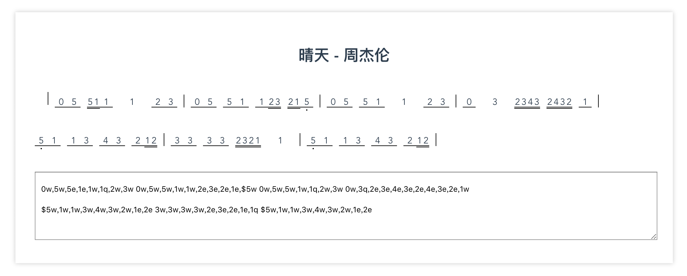

## info
- 做一个简谱渲染，用来记录自己扒的歌


```

// 歌曲数据（手写）
// 写了几个小结，感觉好恶心啊，至少不能光用空格来分隔，在一行写我都不知道写到哪里了，完全迷失，感觉01001001010001011001...也就是这样吧...

export default {
  title: '晴天 - 周杰伦',
  content: '0w,5w,5e,1e,1w,1q,2w,3w 0w,5w,5w,1w,1w,2e,3e,2e,1e,$5w 0w,5w,5w,1w,1q,2w,3w 0w,3q,2e,3e,4e,3e,2e,4e,3e,2e,1w $5w,1w,1w,3w,4w,3w,2w,1e,2e 3w,3w,3w,3w,2e,3e,2e,1e,1q $5w,1w,1w,3w,4w,3w,2w,1e,2e 3w,3w,3w,3w,2e,3e,2e,1e,1we,$7e $6e,1e,1e,$1e,$7e,1w,1e,1e,1e,1e,1e,$7e,1w,7e'
}

```

## rules
- 音高
  - 0-7分别代表休止符和音高
  - ^$ 代表高音低音，支持倍高音和倍低音
  - #1 @1 代表升1和降1
    - 有个bug，十六分音符不能使用，否则会导致样式错乱。原因是十六分音符太短，暂时都是固定宽度，所以加上之后就很难看
- 节奏
  - 十六分音符为最小单位
  - qwe 分别代表四分音符、八分音符、十六分音符
  - qw 代表带附点的四分音符，其他以此类推
  - qq qqqq 代表二分音符、全音符
- 逗号用来区分音符
- 空格用来区分小节
- 举例两个小节：^^1q,$2q,3w,3w,4q 1q,2q,3q,4q

## todo
- 歌曲的content格式还是不够人性化
  - 记谱快
  - 易修改
- 对于格式不严格按照规则来写的谱子很可能展示出错误的样式
  - 希望能有一定的纠错能力
  - 一些错误提示
