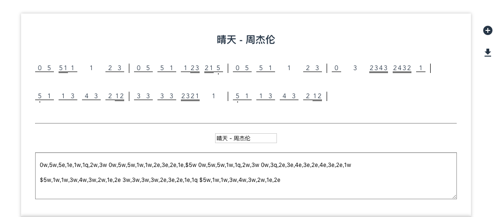

## info
- 做一个简谱渲染，用来记录自己扒的歌
- 默认示例包含《小星星》的主题、莫扎特前几段变奏以及终变奏的精彩片段，方便对照参考更复杂的节奏、音高与和弦写法

## rules
- 音高
  - 0-7分别代表休止符和音高
  - ^$ 代表高音低音，支持倍高音和倍低音
  - #1 @1 代表升1和降1
    - 有个bug，十六分音符不能使用，否则会导致样式错乱。原因是十六分音符太短，暂时都是固定宽度，所以加上之后就很难看
- 节奏
  - 十六分音符为最小单位
  - qwe 分别代表四分音符、八分音符、十六分音符
  - qw 代表带附点的四分音符，其他以此类推
  - qq qqqq 代表二分音符、全音符
- 逗号用来区分音符
- 空格用来区分小节
- 和弦
  - 使用中括号包裹需要同时演奏的音符，并用`+`号分隔，例如 `[1+3+5]q`
  - 和弦中的每个音都可以单独携带高低音符号和升降号，例如 `[^^1+$5+^3]e`
- 举例两个小节：^^1q,$2q,3w,3w,4q 1q,2q,3q,4q

## todo
- 歌曲的content格式还是不够人性化
  - 记谱快
  - 易修改
- 对于格式不严格按照规则来写的谱子很可能展示出错误的样式
  - 希望能有一定的纠错能力
  - 一些错误提示
- 更改符号，增加本地保存
  - 由于中午练了一下【遥远的你】，结果下午一到公司寻思自己写个简谱，用自己的工具，结果基本上写完了，整个过一遍的时候突然觉得有点奇怪，然后就刷新了，然后就没有然后了。。。因为在线写完没有保存。。。我是不是应该增加个存在localstorage里面？另外我发现$5w,$3e这样的打起来依然很麻烦，一个是逗号没必要存在，在一个是$5w来回按还要按shift，很不顺手
